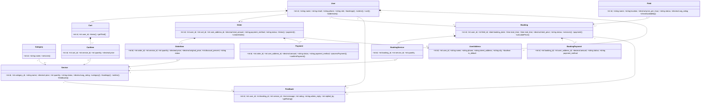

# Class diagram — Sports Shop & Field Booking System

```mermaid
classDiagram
class User { +int id; +string name; +string email; +string phone; +string role; +bookings(); +orders(); +cart(); +addresses() }
class Category { +int id; +string name; +services() }
class Service { +int id; +int category_id; +string name; +decimal price; +int quantity; +string status; +decimal avg_rating; +category(); +bookings(); +orders(); +feedbacks() }
class Field { +int id; +string name; +string location; +decimal price_per_hour; +string status; +decimal avg_rating; +checkAvailability() }
class Cart { +int id; +int user_id; +items(); +getTotal() }
class CartItem { +int id; +int cart_id; +int service_id; +int quantity; +decimal price }
class Order { +int id; +int user_id; +int cart_id; +int user_address_id; +decimal total_amount; +string payment_method; +string status; +items(); +payment(); +createOrder() }
class OrderItem { +int id; +int order_id; +int service_id; +int quantity; +decimal price; +decimal original_price; +int discount_percent; +string status }
class Payment { +int id; +int order_id; +int user_address_id; +decimal amount; +string status; +string payment_method; +processPayment(); +confirmPayment() }
class Booking { +int id; +int user_id; +int field_id; +date booking_date; +time start_time; +time end_time; +decimal total_price; +string status; +services(); +payment(); +calculatePrice() }
class BookingService { +int id; +int booking_id; +int service_id; +int quantity }
class BookingPayment { +int id; +int booking_id; +int user_address_id; +decimal amount; +string status; +string payment_method }
class Feedback { +int id; +int user_id; +int booking_id; +int service_id; +text message; +int rating; +string admin_reply; +int replied_by; +getRating() }
class UserAddress { +int id; +int user_id; +string name; +string phone; +string street_address; +string city; +boolean is_default }
User "1" *-- "0..1" Cart
User "1" --> "0..*" Order
User "1" --> "0..*" Booking
User "1" --> "0..*" Feedback
User "1" *-- "0..*" UserAddress
Category "1" --> "0..*" Service
Cart "1" *-- "0..*" CartItem
CartItem "0..*" --> "1" Service
Order "1" *-- "1..*" OrderItem
OrderItem "0..*" --> "1" Service
Order "1" *-- "0..*" Payment
Order "0..*" --> "0..1" UserAddress
Field "1" --> "0..*" Booking
Booking "1" *-- "0..*" BookingService
BookingService "0..*" --> "1" Service
Booking "1" *-- "0..*" BookingPayment
Booking "1" --> "0..*" Feedback
Service "1" --> "0..*" Feedback
```

`booking_services` và `order_items` là các lớp trung gian vì có thuộc tính riêng.
